# SETU | Full Stack Web Development Assignment 1

This is a simple project for learning full stack web development based upon a template called 'playtime' created by Eamonn de Leastar (Lecturer at SETU, Waterford, Ireland).

This is a node.js, hapi.js, and TDD (Test Driven Development) based project, designed to work well with the Glitch development environment as well. It includes basic hapi setup, handlebars templating, routing, + lowdb database, Joi validation, Restful and openAPI, and JWT API authentication.

# PlaceMark App

This website is about implementing a Point of Interest app using:

- node.js
- hapi,js
- Joi Schema validation
- Handlebars
- lowdb database
- [Mongo DB](https://www.mongodb.com/) database
- json database
- RestFul API implementations
- openAPI
- [Cloudinary](https://cloudinary.com/)
- [Render](https://render.com/)

whose data can be manually submitted by the user, and fed into the app, and sored into a Mongo database .

# What this project does

Its purpose is simply to create and show placemarks or [points of interest](https://en.wikipedia.org/wiki/Point_of_interest) to the user, which, as mentioned earlier, are fed into the app by the user itself. In a nutshell, the user creates their own points of interest via a [Bulma form](https://bulma.io/documentation/form/). However, these placemarks will be 'categorized', namely they are created on the hill of a category, which precedes them in the app hierarchy (user -> categories -> placemarks).
Therefore, the user will first sign-up or log-in, then, they will create a category (only 4 categories are allowed per user), and, once the category is created, relevant placemarks will be added for each category (Ex. category 'Restaurants' -> placemark 'A Casa do Porco, São Paulo').

In a nutshell, the user will have a dashboard with a list of categories they have added, and each of them will link out to a list of their placemarks. Additionaly, each placemark will link out to a simple dedicated and individual placemark landing page.

# Why the project is useful

The project is useful for those users that would like to note down those destinations or, better said, those points of interest/placemarks/locations, and so on and so forth, that they would like to visit. Nevertheless, the user will also be able to mark down whether a placemark has finally been visited. As I will explained further down this document, selcting whether a placemark has been visited or not is actually a mandatory field in the placemark form and its info is relevants for 'statistical purposes'.

Apart from all of the above, the very main purpose of the project was for the writer to be exposed to the use of Bulma components, Javascript, node.js, hapi.js, handlebars, and all of the frameworks, modules, platforms above mentioned, when developing a MVC [Model View Controller](https://en.wikipedia.org/wiki/Model%E2%80%93view%E2%80%93controller).

The ultimate idea here would have also been to expand the website insofar that it would have included a Google map indicated the geolocation of each placemark right inside each placemark card (the one currently in it is just a placeholder).

In addition to that, I wanted to ensure that the user geocoordinates, added when signing up, would be values retrieved from a function that calculates the distance from the user location to the placemark locatio. Alás, I did not get that far, hence, the user will have to also add their coordinates to the category they create to ensure that they will at least have a calculation of the furthest and nearest placemark in their list.

Technical challenges at this stage of my study are not always easy to overcome. Nevertheless, I count on the lectures to come to be able to fill my knowledge gaps, and being able to ultimately revisit and enhance the app soon.

# How users can get started with the project

## Home page

As a user opens up the **PlaceMark** app, they will see a sticky nav bar on the top for an easy navigation throughout the website.

### Navigation bars

The Navbar shows all items that the user needs for a comfortable and friendly navigation.
The **welcome-menu.hbs** partial is the one that the user will see in the 'log out' state (it also contains the PlaceMark logo, which is clickable and links to the Homepage **main.hbs**.):,

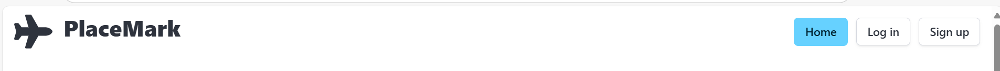

whereas the **menu.hbs** is what the user will see in their loggedin state, which contain more items (it also contains the logo, which is clickable and links to the Dashboard view **dashboard.hbs**.):

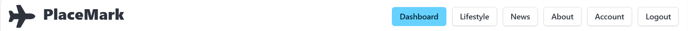

Last, but not least, the navbar is responsive and mobile-friendly:

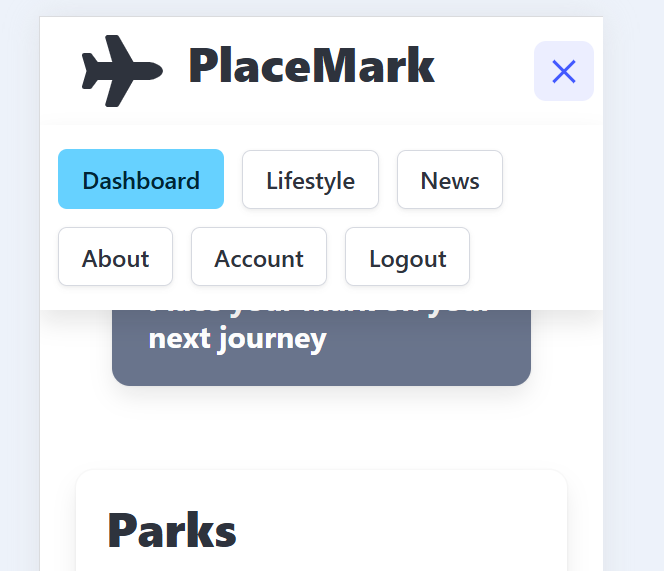

#### Source attribution

Apart from the lecturer examples in the lab, the official bulma documentation in:
https://bulma.io/documentation/components/navbar/

I also studied some examples online such as https://www.geeksforgeeks.org/bulma-navbar/.

### Card Image Grid on the main.hbs page

As the user scrolls down, they will bump into a paragraph inviting the user to log in or sign up, right above a grid made of Bulma card images

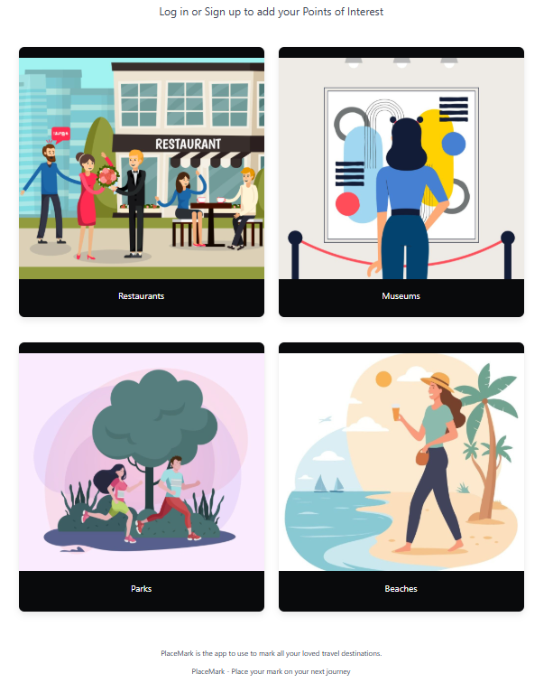

This is just a nice, easy on the eye grid to get the user familiarized with the categories they might want to use.

#### Source attribution

- https://bulma.io/documentation/columns/basics/
- https://bulma.io/documentation/components/card/#examples
- https://www.freepik.com/

### Footer

At the bottom of the page, there is a footer (**footer.hbs** partial), with a 2 column layout.
While the first column shows an Irish address, the column on the right shows nav items/links.
Additionally, there is an underfooter with the 'PlaceMark' clickable logo to boost brand awareness and a string with the developer Linkedin link.

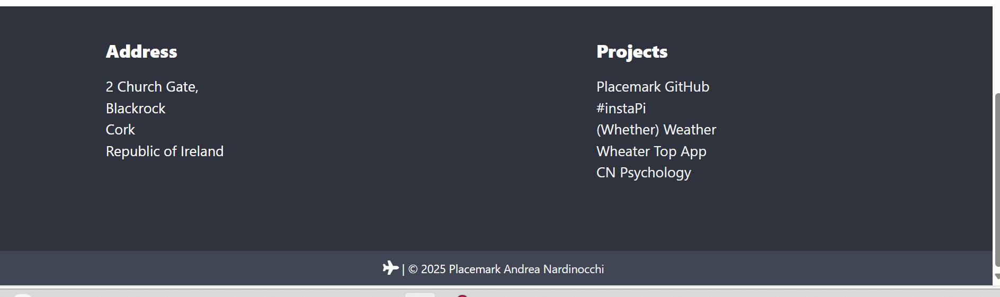

#### Source attribution

- https://bulma.io/documentation/layout/footer/

## Lifestyle page

#### (\*This page is part of a previous assignment for web-dev 1)

This page is basically a blog embedded into the website and users can supposedly use the search bar on the top to search for a tourist destination (I found it interesting to combine the placemark subject with the tourist one).
It shows a variegated layout (**lifestyle-view.hbs**).

#### Source attribution

- https://bulma.io/documentation/elements/box/
- https://bulma.io/documentation/elements/image/#arbitrary-ratios-with-any-

All images have been taken from:
https://pixabay.com/ and used availing of the IMGBB image hosting app in https://imgbb.com/ .

## News

(\*This page is part of a previous assignment web-dev 1)

This page is supposed to be a 'news' page to get travelers up to speed with the latest news about tourist destinations (**news-view.hbs**).

#### Source attribution

- https://bulma.io/documentation/elements/box/

All images have been taken from:
https://pixabay.com/ and used availing of the IMGBB image hosting app in https://imgbb.com/ .

## About page

This is just a simple and plain page with a centered copy (header and paraghraph, **about-view.hbs**) contained in a class 'box':

## Log in

The 'Log in' page is a 2 column layout with a Bulma form on the left column and the PlaceMark logo on the right (**login-view**):

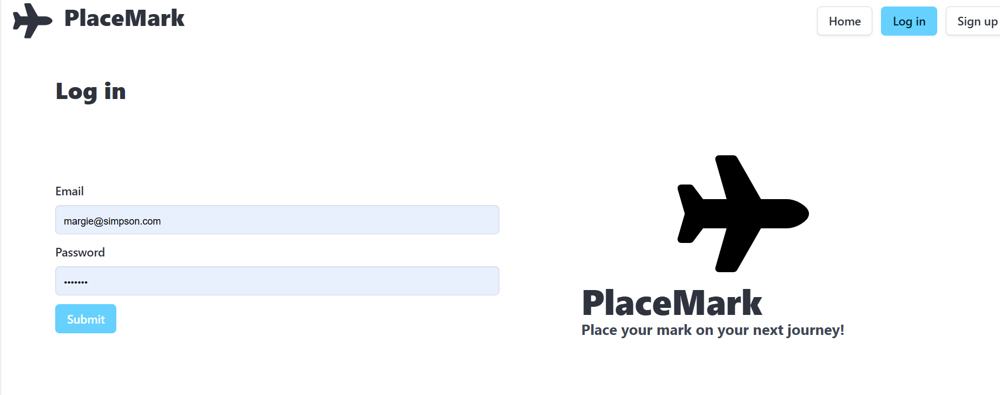

It is routed as per the below line of code in **web-routes.js**

```
 { method: "GET", path: "/login", config: accountsController.showLogin },
```

and its view is rendered by the **accounts-controller.js**

```
  showLogin: {
    auth: false,
    handler: function (request, h) {
      return h.view("login-view", { title: "Login to Placemark" });
    },
  },
  login: {
    auth: false,
    validate: {
      payload: UserCredentialsSpec,
      options: { abortEarly: false },
      failAction: function (request, h, error) {
        return h.view("login-view", { title: "Login error", errors: error.details }).takeover().code(400);
      },
    },
    handler: async function (request, h) {
      const { email, password } = request.payload;
      const user = await db.userStore.getUserByEmail(email);
      if (!user || user.password !== password) {
        return h.redirect("/");
      }
      // We set the cookie and istall the object 'user', passing the '._id' of the user
      request.cookieAuth.set({ id: user._id });
      return h.redirect("/dashboard");
    },
```

Once the user prompts the log in action, their data will be verified by the above 'handler' which will check email and password. The below function, instead, will validate whether the user exists by checking that the 'payload' of the variable 'UserCredentialsSpec' (Joi schema).

```
 /**
   * The function has access to a session object - which will have the users ID.
   * We use this ID to locate the user object from the store and, if found,
   * return this object: { isValid: true, credentials: user }; otherwise
   * { valid: false };
   */
  async validate(request, session) {
    const user = await db.userStore.getUserById(session.id);
    if (!user) {
      return { isValid: false };
    }
    return { isValid: true, credentials: user };
  },
```

#### Source attribution

Plane image taken from:
https://fontawesome.com/v4/icons/

## Sign up

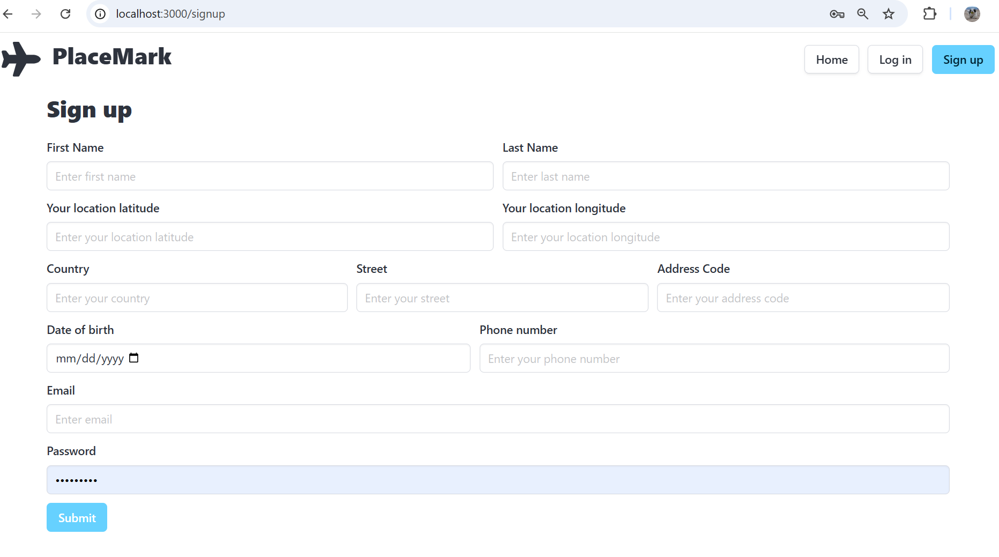

It is routed as per the below line of code in **web-routes.js**

```
 { method: "GET", path: "/signup", config: accountsController.showSignup },
```

and its view is rendered by the **accounts-controller.js**

```
  signup: {
    auth: false,
    /**
     * validate object specifying our validation schema
     * (UserSpec) + failAction method,
     * to be called if the validation fails.
     * 'errors: error.details' will enable the signup page to show the errors
     * .takeover() will avoid the redirection to accountController, as Joi will manage the error
     */
    validate: {
      payload: UserSpec,
      options: { abortEarly: false },
      failAction: function (request, h, error) {
        return h.view("signup-view", { title: "Sign up error", errors: error.details }).takeover().code(400);
      },
    },
    handler: async function (request, h) {
      const user = request.payload;
      console.log("This is the currentHour: ", user);
      await db.userStore.addUser(user);
      return h.redirect("/");
    },
  },
```

Once a new user object is created, the validation() function will check the Joi scema UserSpec data, and if it comes across any issues, the failAction method will be called in and redirects the page to the how the errors.

The user data will, then, be stored into one of the stores being used by the app administrator:

- user-mongo-store.js
- user-json-store.js
- user-mem-store.js

**Mongoose T3**

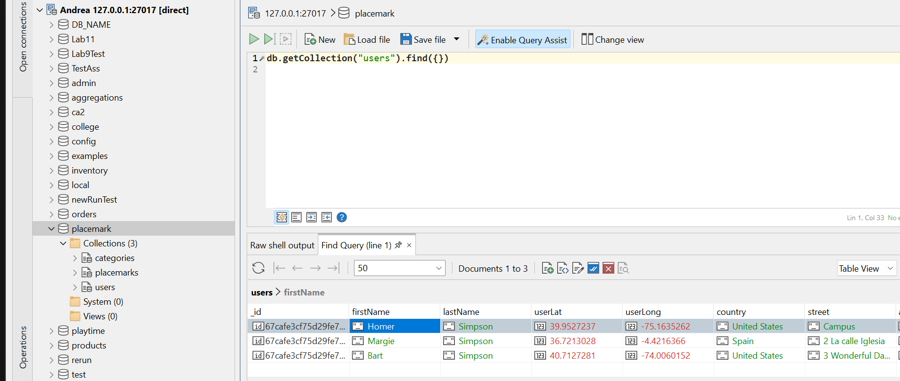

**json**

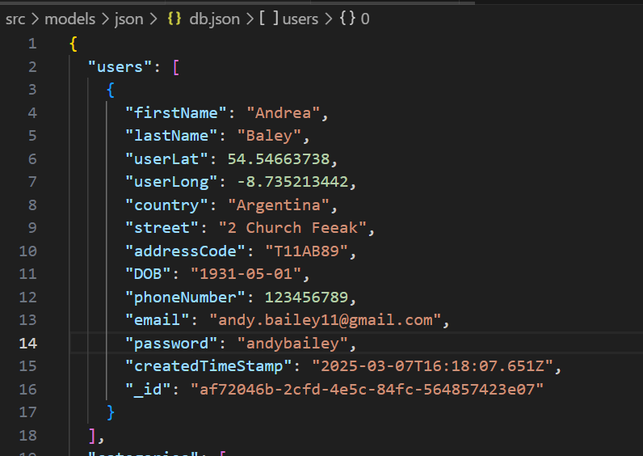

The way that we tie these database logics is via the **db.js**, which is basically a facade from which we can choose the database we want the app to use.

#### Source attribution

- https://www.mongodb.org
- https://robomongo.org

## Joi Schema

The information the user will be inputting is defined in the Joi Schema file **joi-schema.js** which indicates 'string', 'number', 'date' fields with certain value ranges which might or might not be indicated as well as whether they are required or not. Ex.:

```
export const UserSpec = UserCredentialsSpec.keys({
  firstName: Joi.string().min(3).max(30).example("Homer").required(),
  lastName: Joi.string().min(3).max(30).example("Simpson").required(),
  userLat: Joi.number().max(100).example(40.41541290283203),
  userLong: Joi.number().max(100).example(-3.684231996536255),
  country: Joi.string().min(3).max(30).example("Portugal").required(),
  street: Joi.string().min(3).max(50).example("Rua das Flores, 4").required(),
  addressCode: Joi.string().min(3).max(15).example("T12Y2NE").required(),
  DOB: JoiExtended.date().raw().format().required(),
  phoneNumber: Joi.number().example(892356189).required(),
  createdTimeStamp: JoiExtended.date().default(() => new Date()),
}).label("UserDetails");
```

The same logic applies to the 'categories' and 'placemarks' data.

## Account page

This page is where the user can check their personal details, and, also, update them via a Bulma form, which will show in aa pop-up:

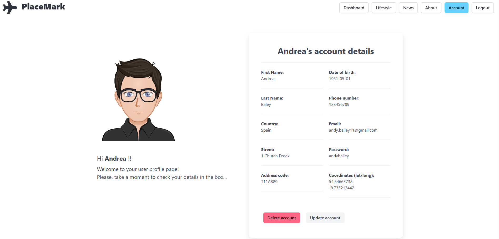

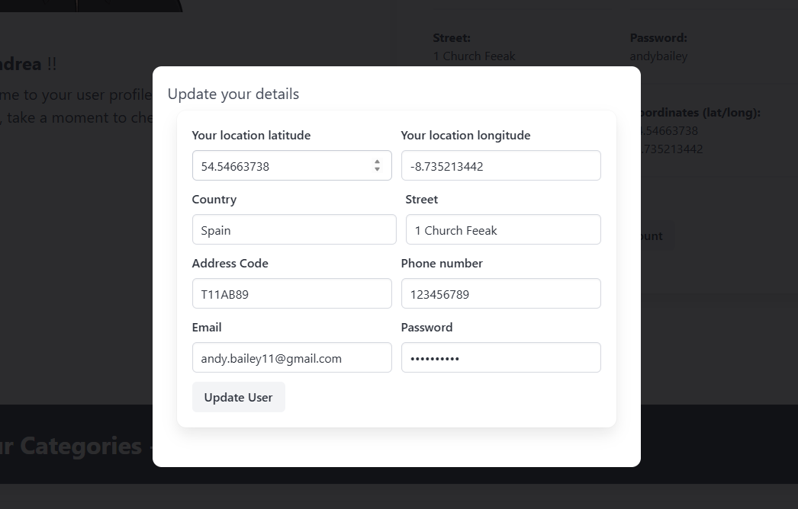

The **accounts-controller.js** renders the page through the below 'showAccount' handler

```
 showAccount: {
    handler: async function (request, h) {
      const loggedInUser = request.auth.credentials;
      const categories = await db.categoryStore.getUserCategories(loggedInUser._id);
      const accCat0 = await somethingAnalytics.getAccountCategories0(categories);
      const accCatId0 = await somethingAnalytics.getAccountCategoriesId0(categories);
      const accCat1 = await somethingAnalytics.getAccountCategories1(categories);
      const accCatId1 = await somethingAnalytics.getAccountCategoriesId1(categories);
      const accCat2 = await somethingAnalytics.getAccountCategories2(categories);
      const accCatId2 = await somethingAnalytics.getAccountCategoriesId2(categories);
      const accCat3 = await somethingAnalytics.getAccountCategories3(categories);
      const accCatId3 = await somethingAnalytics.getAccountCategoriesId3(categories);
      const userDetails = await db.userStore.getUserById(loggedInUser._id);
      const viewData = {
        title: "Your Account details | PlaceMark",
        user: loggedInUser,
        firstName: userDetails.firstName,
        lastName: userDetails.lastName,
        userLat: userDetails.userLat,
        userLong: userDetails.userLong,
        country: userDetails.country,
        street: userDetails.street,
        addressCode: userDetails.addressCode,
        DOB: userDetails.DOB,
        phoneNumber: userDetails.phoneNumber,
        email: userDetails.email,
        password: userDetails.password,
        accCat0: accCat0,
        accCatId0: accCatId0,
        accCat1: accCat1,
        accCatId1: accCatId1,
        accCat2: accCat2,
        accCatId2: accCatId2,
        accCat3: accCat3,
        accCatId3: accCatId3,
        _id: userDetails._id,
        createdTimeStamp: userDetails.createdTimeStamp,
      };
      return h.view("account-view", viewData);
    },
  },
```

After requesting the autorized credentials, I retrieve the 'categories' of the loggedInUser as well as their 'userDetails'. The userDetails const retrieves all information from the userStore, and, then, the const 'viewData' will itemize it to get rendered on the account-view.

If the user wished to update their details, or even delet the account altogether, the below handlers will make the above-mentioned actions possible:

```
deleteAccount: {
    handler: async function (request, h) {
      const loggedInUser = request.auth.credentials;
      const user = await db.userStore.getUserById(loggedInUser._id);
      await db.userStore.deleteUserById(user._id);
      request.cookieAuth.clear();
      return h.redirect("/");
    },
  },

  updateAccount: {
    validate: {
      payload: updatedUserSpec,
      options: { abortEarly: false },
      failAction: function (request, h, error) {
        return h.view("account-view", { title: "Update user details error", errors: error.details }).takeover().code(400);
      },
    },
    handler: async function (request, h) {
      const loggedInUser = request.auth.credentials;
      const user = await db.userStore.getUserById(loggedInUser._id);
      const newUserLat = Number(request.payload.userLat);
      const newUserLong = Number(request.payload.userLong);
      const newCountry = request.payload.country;
      const newStreet = request.payload.street;
      const newAddressCode = request.payload.addressCode;
      const newPhoneNumber = Number(request.payload.phoneNumber);
      const newEmail = request.payload.email;
      const newPassword = request.payload.password;
      const updatedUser = {
        userLat: newUserLat,
        userLong: newUserLong,
        country: newCountry,
        street: newStreet,
        addressCode: newAddressCode,
        phoneNumber: newPhoneNumber,
        email: newEmail,
        password: newPassword,
        _id: user._id,
      };
      await db.userStore.updateUser(user, updatedUser);
      return h.redirect("/account");
    },
  },
```

The updateUser() function from the userStore will enable the user details updates:

**user-mongo-store.js**

```
 async updateUser(user, updatedUser) {
    const userDoc = await User.findOne({ _id: user._id });
    console.log(userDoc);
    user._id = updatedUser._id;
    userDoc.userLat = updatedUser.userLat;
    userDoc.userLong = updatedUser.userLong;
    userDoc.country = updatedUser.country;
    userDoc.street = updatedUser.street;
    userDoc.addressCode = updatedUser.addressCode;
    userDoc.phoneNumber = updatedUser.phoneNumber;
    userDoc.email = updatedUser.email;
    userDoc.password = updatedUser.password;
    await userDoc.save();
  },
```

**user-json-store.js**

```
async updateUser(user, updatedUser) {
    console.log(updatedUser);
    user._id = updatedUser._id;
    user.userLat = updatedUser.userLat;
    user.userLong = updatedUser.userLong;
    user.country = updatedUser.country;
    user.street = updatedUser.street;
    user.addressCode = updatedUser.addressCode;
    user.phoneNumber = updatedUser.phoneNumber;
    user.email = updatedUser.email;
    user.password = updatedUser.password;
    await db.write();
    console.log(user);
    return user;
  },
```

**user-mem-store.js**

```
  async updateUser(user, updatedUser) {
    console.log(updatedUser);
    user._id = updatedUser._id;
    user.userLat = updatedUser.userLat;
    user.userLong = updatedUser.userLong;
    user.country = updatedUser.country;
    user.street = updatedUser.street;
    user.addressCode = updatedUser.addressCode;
    user.phoneNumber = updatedUser.phoneNumber;
    user.email = updatedUser.email;
    user.password = updatedUser.password;
    console.log(user);
    return user;
  },
```

It is worth spending a few lines on a few variables created an itemized in the 'viewData' variable:

```
const accCat0 = await somethingAnalytics.getAccountCategories0(categories);
const accCatId0 = await somethingAnalytics.getAccountCategoriesId0(categories);
const accCat1 = await somethingAnalytics.getAccountCategories1(categories);
const accCatId1 = await somethingAnalytics.getAccountCategoriesId1(categories);
const accCat2 = await somethingAnalytics.getAccountCategories2(categories);
const accCatId2 = await somethingAnalytics.getAccountCategoriesId2(categories);
const accCat3 = await somethingAnalytics.getAccountCategories3(categories);
const accCatId3 = await somethingAnalytics.getAccountCategoriesId3(categories);
```

Here, the objective is to retrieve the titles of the categories as well as their ids since the partial **stats-account.hbs** embedded in the **account-view.hbs** will show the categories that the user added. In the example below there is an extract of the functions created in the **something-analytics.js** util file to achieve just that:

```
 getAccountCategories0(categories) {
    let accCat = "";
    // eslint-disable-next-line prefer-const
    let accCats = [];
    // eslint-disable-next-line prefer-const
    let accCatsId = [];
    let accCatId = "";
    categories.forEach((category) => {
      accCat = category.title;
      accCatId = category._id;
      accCats.push(accCat);
      accCatsId.push(accCatId);
    });
    // eslint-disable-next-line prefer-const
    let accCat0 = accCats[0];
    return accCat0;
  },

  getAccountCategoriesId0(categories) {
    let accCat = "";
    // eslint-disable-next-line prefer-const
    let accCats = [];
    // eslint-disable-next-line prefer-const
    let accCatsId = [];
    let accCatId = "";
    categories.forEach((category) => {
      accCat = category.title;
      accCatId = category._id;
      accCats.push(accCat);
      accCatsId.push(accCatId);
    });
    // eslint-disable-next-line prefer-const
    let accCatId0 = accCatsId[0];
    return accCatId0;
  },
```

The 'categories' value is passed along the parameter 'categories' in the above function, and then through iteration we fetch the category values we need to show in the account page, namely the 'title' of the category as well as its id which is needed to create a URL to make the title clickable (see the **stats-account.hbs**):

```
 <section class = "content pl-4">
    <div class="columns">
      <div class="column">
        <p class="is-size-4 mb-2 "><a href="/category/{{accCatId0}}" class="has-text-grey-light">{{accCat0}}</a> </p>
        <p class="is-size-4 mb-2"><a href="/category/{{accCatId1}}" class="has-text-grey-light">{{accCat1}}</a> </p>
        <p class="is-size-4 mb-2 "><a href="/category/{{accCatId2}}" class="has-text-grey-light">{{accCat2}}</a> </p>
        <p class="is-size-4 mb-6"><a href="/category/{{accCatId3}}" class="has-text-grey-light">{{accCat3}}</a> </p>
        <p class="is-size-7">* If you have added any categories, they will get displayed in this box. </p>
      </div>
    </div>
  </section>
```

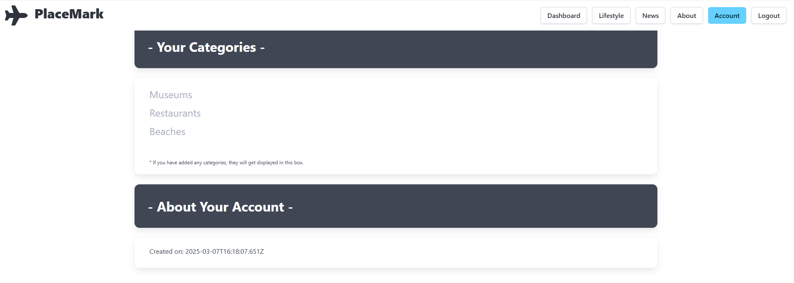

The **joi-schemas.js** also contains the below line which produces a 'time stamp' of when the account was created:

```
createdTimeStamp: JoiExtended.date().default(() => new Date()),

```

This is the list of the HTML files created for the account page:

- account-view.hbs
- user-deatils.hbs
- stats-account.hbs

and this is the list of the routes in **web-routse.js**:

```
 { method: "GET", path: "/", config: accountsController.index },
  { method: "GET", path: "/signup", config: accountsController.showSignup },
  { method: "GET", path: "/login", config: accountsController.showLogin },
  { method: "GET", path: "/logout", config: accountsController.logout },
  { method: "POST", path: "/register", config: accountsController.signup },
  { method: "POST", path: "/authenticate", config: accountsController.login },
  { method: "GET", path: "/account", config: accountsController.showAccount },
  { method: "GET", path: "/account/deleteuser/{id}", config: accountsController.deleteAccount },
  { method: "GET", path: "/account/edituser/", config: accountsController.showAccount },
  { method: "POST", path: "/account/updateuser/", config: accountsController.updateAccount },
```

#### Source attribution

- https://bulma.io/documentation/form/
- https://bulma.io/documentation/components/modal/
- https://endgrate.com/blog/using-the-mongodb-api-to-create-or-update-records-(with-javascript-examples)
- https://www.geeksforgeeks.org/how-to-set-minimum-and-maximum-date-in-html-date-picker/

## Bugs/Defects

- The purpose of having the user add their location geocoordinates was for them to be utilized for the calculation of the distance bewteen the user and the placemark locations. However, I was unable to find a way to inject the user geocoordinates into any util files to create an ad hoc function. Therefore, I am having the user add their location geocoordinates again whenever they add a new category in the dashboard.

## Dahboard

data will be they will land to their dashboard (**dashboard-view.hbs**):

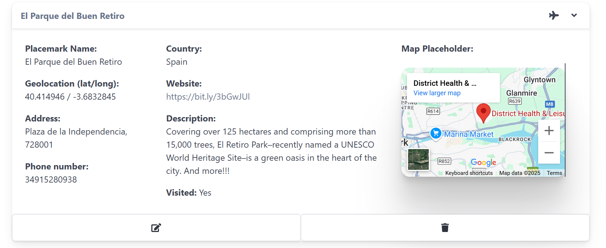

As seen above, there is a Bulma form to add a station/city and its coordinates with a button.
A short line with a link opening to a new tab on LatLong.net has been added to help the user find the coordinates of the city they wish to check the weather conditions of.
The rationale behind that is that I wanted to let the user add manual reports in the Station View and be able to use accurate coordinates that match with those rendered by the integrated API https://api.openweathermap.org/data/2.5/weather call.

After getting the form (**add-station.hbs** partial) filled out and submitted

```
<form class="box" action="/dashboard/addstation" method="POST">
```

5 Bulma Cards are shown with icons and data to be fed into (**list-stations.hbs**)

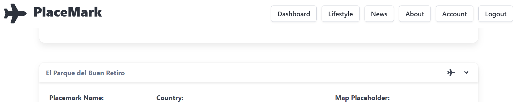

The Dahboard view is rendered in the **dashboard-controllers.js**

```
  /* The below 'index' action is invoked when "/dashboard" route is triggered (user must be 'logged in').
 'render' passes the object 'viewData' */
  async index(request, response) {
    // Discovering which user is logged in by retrieving data from the model 'user-store.js'.
    const loggedInUser = await accountsController.getLoggedInUser(request);
    // Discovering which stations are stored in the station-store.js and associated to that specific user.
    const stations = await weatherStation.getStationsByUserId(loggedInUser._id);
     // The 'sortedStations' object invokes a method contained in the 'weatherstationAnalytics' utility to sort the stations in alhabetical order
    const sortedStations = weatherstationAnalytics.getSortedStations(stations);
    const viewData = {
      title: "Forecast Stations Dashboard | Weather Top App",
      stations: sortedStations,
    };
    // If user known, it creates a cookie called 'weathertop' containing the loggedin user 'id'
    console.log("dashboard rendering");
    response.cookie("weathertop", loggedInUser._id);
    response.render("dashboard-view", viewData);
  },
```

and it is routed via the below code line

```
router.get("/dashboard", dashboardController.index);
```

As the user clicks on the leftmost icon right below the cards, they will be redirected to the Station View page.

The action to add or delete station can be observed in the above-mentioned controller:

```
/* The below 'addStation' action is invoked when "/dashboard/addstation" route is triggered (user must be 'logged in'). */
  async addStation(request, response) {
    // Discovering which user is logged in by retrieving the data from the model 'user-store.js'.
    const loggedInUser = await accountsController.getLoggedInUser(request);
    // Creating object 'newStation' to pass data inputted by the user
    const newStation = {
      title: request.body.title,
      latitude: request.body.latitude,
      longitude: request.body.longitude,
      userid: loggedInUser._id,
    };
    console.log(`adding station ${newStation.title}`);
    // The function 'addStation()' in station-store.js' will add the new station
    await weatherStation.addStation(newStation);
    response.redirect("/dashboard");
  },

  /* The below 'deleteStation' action is invoked when "/dashboard/deletestation/:id" route is triggered (user must be 'logged in'). */
  async deleteStation(request, response) {
    // The object stationId will pass the station id to delete
    const stationId = request.params.id;
    console.log(`Deleting Station ${stationId}`);
    // The function deleteStationById() is invoked from the model station-store.js file
    await weatherStation.deleteStationById(stationId);
    response.redirect("/dashboard");
  },
```

and the model that stores station data is **station-store.js**, which, in turn, generates the **station.json** file.
Whenever a new station is added, the user id is listed in the json file along with the station id just created:

```
title": "Austin",
      "latitude": "30.2711286",
      "longitude": "-97.7436995",
      "userid": "1ccd6a07-13bb-4d99-88de-80863a4346aa",
      "_id": "c607cf56-eea5-48ec-bce3-0c7641bb72bf"
```

Noteworthy is the method used to get the stations sorted by alphabetical order once the user adds more than one station,

```
const sortedStations = weatherstationAnalytics.getSortedStations(stations);
```

which gets imported from the 'utils' file **weatherstations-analytics.js**

```
getSortedStations(stations) {
    let sortedStations = stations.sort((a, b) => a.title.localeCompare(b.title));
    console.log(stations);
    return sortedStations;
 },
```

All methods to import data from the Station view to feed the dashboard 5 cards with the latest weather conditions of the added stations are in the **dashboard-analytics.js**. However, since these methods are importing data from the Station view and since the handlebars 'expressions' used in the **list-station.hbs** partial are iterated through an '{{#each stations}}' loop, a 'getStationData(station)' was created to retrieve the 'properties' of the 'stations' array as seen in https://stackoverflow.com/questions/6439915/how-to-set-a-javascript-object-values-dynamically/6439954#6439954 .

```
  /* The method getStationData(station); is basically the same method as the reportStore.updateReport() one and
  will make the latest station details show on the dashboard view (passing them through to the latter).
  https://stackoverflow.com/questions/6439915/how-to-set-a-javascript-object-values-dynamically/6439954#6439954 */
  async getStationData(station) {
    // Retrieving the below object values/data from report-store.js
    const reports = await reportStore.getReportsByStationId(station._id);
    if (reports.length > 0) {
      const temperature = dashboardAnalytics.getTemperature(station);
      const feelsLike = dashboardAnalytics.getFeelsLike(station);
      const humidity = dashboardAnalytics.getHumidity(station);
      const tempFar = dashboardAnalytics.getTempFar(station);
      const maxTemp = dashboardAnalytics.getMaxTemp(station);
      const minTemp = dashboardAnalytics.getMinTemp(station);
      const wind = dashboardAnalytics.getWind(station);
      const windDirect = dashboardAnalytics.getWindDirect(station);
      const windDir = dashboardAnalytics.getWindDir(station);
      const maxWindSpeed = dashboardAnalytics.getMaxWindSpeed(station);
      const minWindSpeed = dashboardAnalytics.getMinWindSpeed(station);
      const pressure = dashboardAnalytics.getPressure(station);
      const maxPressure = dashboardAnalytics.getMaxPressure(station);
      const minPressure = dashboardAnalytics.getMinPressure(station);
      const iconCode = dashboardAnalytics.getIconCode(station);
      const weatherType = dashboardAnalytics.getWeatherType(station);
      // Creating a new object 'newStation' and retrieving values
      const newStation = {};
      newStation['temperature'] = temperature;
      newStation['feelsLike'] = feelsLike;
      newStation['humidity'] = humidity;
      newStation['tempFar'] = tempFar;
      newStation['maxTemp'] = maxTemp;
      newStation['minTemp'] = minTemp;
      newStation['wind'] = wind;
      newStation['windDirect'] = windDirect;
      newStation['windDir'] = windDir;
      newStation['maxWindSpeed'] = maxWindSpeed;
      newStation['minWindSpeed'] = minWindSpeed;
      newStation['pressure'] = pressure;
      newStation['maxPressure'] = maxPressure;
      newStation['minPressure'] = minPressure;
      newStation['iconCode'] = iconCode;
      newStation['weatherType'] = weatherType;
      console.log(newStation + iconCode);
      console.log("Updating station data for " + station.title);
      /* The below action calls a new method 'weatherStation.updateStationDetails' and passes
      both the original stations and the updated ones into the station-store.js model, which then
      will enable the dashboard-view to render them */
      weatherStation.updateStationDetails(station, newStation);
   }
  }
```

#### Source attribution

https://bulma.io/documentation/components/card/

https://www.flaticon.com/

Sorted stations method https://www.youtube.com/watch?v=CTHhlx25X-U

Broken icon styling method in https://dev.to/stephenafamo/the-best-way-to-style-broken-images-29k on **list-station.hbs**

https://stackoverflow.com/questions/6439915/how-to-set-a-javascript-object-values-dynamically/6439954#6439954

## Station

The Station view is the page where the user lands on when clicking on the leftmost CTA, right below the 5 cards in the Dashboard view.

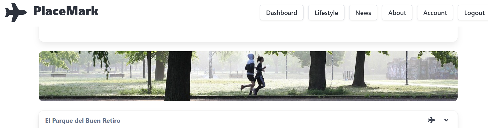

```
  <a href="/station/{{_id}}" class="button">
  {{>icons/open}}
```

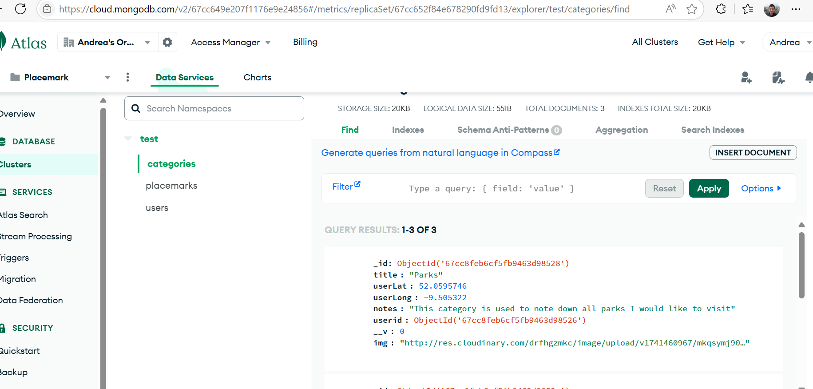

The Station view in **station-view.hbs** is rendered by the 'index' action in the **station-controller.js** file:

```
async index(request, response) {
    // Discovering the station by its id by retrieving data from the model 'station-store.js'.
    const station = await weatherStation.getStationById(request.params.id);
    // The below action will call out the method getStationData(station); from the 'weatherStation' utility.
    await weatherstationAnalytics.getStationData(station);
    /* Creating new object by calling out methods from 'station-analytics.js' utility.
    All of them will be called in in the 'handlebars' via 'expressions' ({{}}) */
    const temperatureReport = stationAnalytics.getTemperatureReport(station);
    const tempFarReport = stationAnalytics.getTempFarReport(station);
    const maxTempReport = stationAnalytics.getMaxTempReport(station);
    const minTempReport = stationAnalytics.getMinTempReport(station);
    const maxWindSpeedReport = stationAnalytics.getMaxWindSpeedReport(station);
    const minWindSpeedReport= stationAnalytics.getMinWindSpeedReport(station);
    const windDirection = stationAnalytics.getWindDirectionReport(station);
    const windDir = stationAnalytics.getWindDir(station);
    const windReport = stationAnalytics.getWindReport(station);
    const pressureReport = stationAnalytics.getPressureReport(station);
    const maxPressureReport = stationAnalytics.getMaxPressureReport(station);
    const minPressureReport = stationAnalytics.getMinPressureReport(station);
    const iconCodeReport = stationAnalytics.getIconCodeReport(station);
    const weatherTypeReport = stationAnalytics.getWeatherTypeReport(station);
    const feelsLikeReport = stationAnalytics.getFeelsLikeReport(station);
    const humidityReport = stationAnalytics.getHumidityReport(station);
    const viewData = {
      title: "Station View | Weather Top App",
      station: station,
      temperatureReport: temperatureReport,
      tempFarReport: tempFarReport,
      maxTempReport: maxTempReport,
      minTempReport: minTempReport,
      windReport: windReport,
      maxWindSpeedReport: maxWindSpeedReport,
      minWindSpeedReport: minWindSpeedReport,
      windDirection: windDirection,
      windDir: windDir,
      pressureReport: pressureReport,
      maxPressureReport: maxPressureReport,
      minPressureReport: minPressureReport,
      iconCodeReport: iconCodeReport,
      weatherTypeReport: weatherTypeReport,
      feelsLikeReport: feelsLikeReport,
      humidityReport: humidityReport,
    };
    response.render("station-view", viewData);
  },

```

As seen in the above code, const variables are created and import data from the functions, in turn, created in the **station-analytics.js** file in the 'utils' folder. The variables and the values (weather conditions data) of their methods populate the 5 cards of the station/city.

The weather conditions data are added through three different actions called in the **station-controller.js**:

- addManualReport()
- addAutoReport()
- addChartReport()

All of the actions above-listed call out their respective methods in the **report-store.js** in which the reports are stored and a reports.json is generated to list them all.

#### addManualReport()

```
  /* The below 'addManualReport' action is invoked when "/station/:id/addmanualreport" route is triggered (user must be 'logged in'). */
async addManualReport(request, response) {
  // Discovering which station is stored in the station-store.js and associated to that specific user.
  const station = await weatherStation.getStationById(request.params.id);
  // Passing data through to add a new report
  const newReport = {
    code: Number(request.body.code),
    temperature: Number(request.body.temperature),
    windSpeed: Number(request.body.windSpeed),
    windDirection: request.body.windDirection,
    windSpeed: Number(request.body.windSpeed),
    pressure: Number(request.body.pressure),
    currentHour: dayjs().format("YYYY-MM-DD HH:mm:ss") // Adding current time
  };
  console.log(`adding report ${newReport.code}`);
  // The below function addManualReport() is retrieved from the model report-store.js
  await reportStore.addManualReport(station._id, newReport);
  response.redirect("/station/" + station._id);
},
```

This action enables the user to manually add station reports via the Bulma form and the **add-report.hbs** partial.

The manual and auto report can also be updated, via the Bulma form in the **edit-user.hbs** partial, triggered when clicking the 'edit icon':

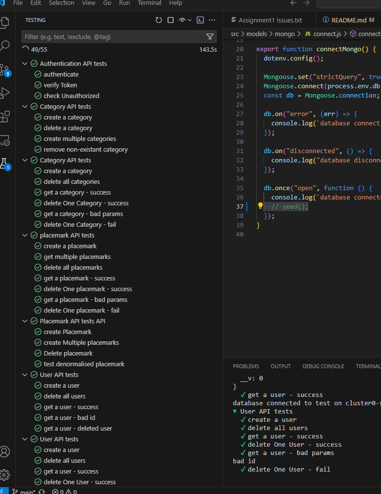

The below edit page is rendered by the **report-controller.js**

```
/* The below 'index' action is invoked when "/station/:id" route is triggered (user must be 'logged in'). */
  async index(request, response) {
    // Passing 'station' and 'report' data through.
    const stationId = request.params.stationid;
    const reportId = request.params.reportid;
    console.log(`Editing Report ${reportId} from Station ${stationId}`);
    const viewData = {
      title: "Edit Station",
      // Stations and reports are rendered as retrieved from the model 'user-store.js' and 'report-store.js'.
      station: await weatherStation.getStationById(stationId),
      report: await reportStore.getReportById(reportId),
    };
    response.render("report-view", viewData);
  },
```

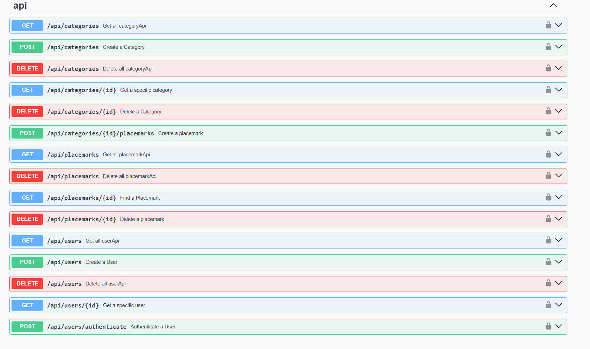
and routed by

```
router.post("/station/:stationid/updatereport/:reportid", reportController.update);
```

The action to get the report updated lives in the **report-controller.js** too

```
/* The below 'index' action is invoked when "/station/:stationid/editreport/:reportid" route is triggered (user must be 'logged in'). */
  async update(request, response) {
    // Passing 'station' and 'report' data through.
    const stationId = request.params.stationid;
    const reportId = request.params.reportid;
    // Creating object updatedReport to update report
    const updatedReport = {
      code: Number(request.body.code),
      temperature: Number(request.body.temperature),
      windSpeed: Number(request.body.windSpeed),
      windDirection: request.body.windDirection,
      windDir: request.body.windDir,
      windSpeed: Number(request.body.windSpeed),
      pressure: Number(request.body.pressure),
    };
    console.log(`Updating Report ${reportId} from Station ${stationId}`);
    // Retrieving the report to update from 'report-store,js'
    const report = await reportStore.getReportById(reportId);
    // The updateReport() function from 'report-store,js' will update the report
    await reportStore.updateReport(report, updatedReport);
    response.redirect("/station/" + stationId);
  },
```

Once the user edits the form field values and clicks on the CTA 'Update report', the action tag in the form in **edit-user.hbs**

```
<form class="box" action="/station/{{station._id}}/updatereport/{{report._id}}" method="POST">
```

will trigger the response on the action updateReport() in **report-controller.js**, as shown above. At that point, the **report-store.js** will update the report data and show them on the **report.json** file

```
{
      "code": 200,
      "temperature": 34,
      "windSpeed": 78,
      "windDirection": "West-northwest (WNW)",
      "windDir": "20",
      "pressure": 45,
      "currentHour": "2024-07-22 18:07:28",
      "_id": "bd4639dd-024c-4aa3-8e4c-addbdac21e74",
      "stationid": "91bcb86d-9c07-4ac7-95cb-54c1915f8fdb"
    },
```

### addAutoReport()

```
/* The below 'addAutoReport' action is invoked when "/station/:id/addautoreport" route is triggered (user must be 'logged in').
  It would be basically the same action as the 'addChartReport', but for the chart the the TempTrend and TempLabels objects, which have not been included in here */
  async addAutoReport(request, response) {
    const station = await weatherStation.getStationById(request.params.id);
    console.log("rendering new report");
    const title = station.title;
    let report = {};
    const cityRequestUrl  = `https://api.openweathermap.org/data/2.5/weather?q=${title}&units=metric&appid=c3e26a0b5387b001f6f548f5710c0baf`;
    const cityResult = await axios.get(cityRequestUrl);
    if (cityResult.status == 200) {
      const currentWeather = cityResult.data;
      report.currentHour = dayjs().format("YYYY-MM-DD HH:mm:ss");
      report.title = currentWeather.name;
      report.longitude = currentWeather.coord.lon;
      report.latitude = currentWeather.coord.lat;
      report.code = currentWeather.weather[0].id;
      report.iconCodeReport = currentWeather.weather[0].icon;
      report.weatherTypeReport = currentWeather.weather[0].main;
      report.temperature = currentWeather.main.temp;
      report.tempFar = (currentWeather.main.temp* 1.8) + 32;
      report.maxTempReport = currentWeather.main.temp_max;
      report.minTempReport = currentWeather.main.temp_min;
      report.feelsLikeReport = currentWeather.main.feels_like;
      report.humidityReport = currentWeather.main.humidity;
      report.windSpeed = currentWeather.wind.speed;
      report.pressure = currentWeather.main.pressure;
      report.windDir = currentWeather.wind.deg;
   }
    console.log(report);
    const viewData = {
      title: "Weather Autogenerated Report | Weather Top App",
      station: report,
      currentHour: dayjs().format("YYYY-MM-DD HH:mm:ss") // Adding current time
    };
    // The function 'addAutoReport()' is retrieved from the model report-store.js
    await reportStore.addAutoReport(station._id, report);
    response.redirect("/station/" + station._id);
  },
```

This action enables the user to get an automated station report based upon an API call that returns weather stations conditions according to the added city name via the Bulma form and the **add-report.hbs** partial :

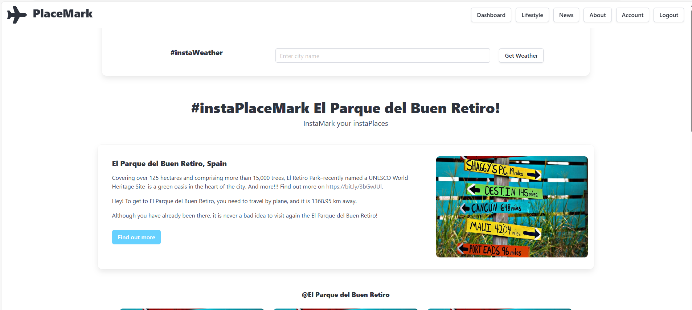

The **report.json** offers a clear picture of the weather conditions data retrieved.

```
 {
      "currentHour": "2024-07-22 18:05:30",
      "title": "Phoenix",
      "longitude": -112.074,
      "latitude": 33.4484,
      "code": 801,
      "iconCodeReport": "02d",
      "weatherTypeReport": "Clouds",
      "temperature": 37.62,
      "tempFar": 99.716,
      "maxTempReport": 38.98,
      "minTempReport": 36.07,
      "feelsLikeReport": 39.12,
      "humidityReport": 31,
      "windSpeed": 3.58,
      "pressure": 1009,
      "windDir": 101,
      "_id": "fd8f31cd-1020-4689-8687-cadd97278979",
      "stationid": "5a04c321-cb35-4c4c-918f-6bc180e09cbc"
    },
```

### addChartReport()

```
/* The below 'addChartReport' action is invoked when "/station/:id/addchartreport" route is triggered (user must be 'logged in'). */
  async addChartReport(request, response) {
    // Discovering which station is stored in the station-store.js and associated to that specific user.
    const station = await weatherStation.getStationById(request.params.id);
    console.log("rendering new report");
    // Retrieving the object 'title' value from the getStationData(station) action in weatherstation-analytics.js
    const title = station.title;
    let report = {};
    // Creating a cityRequestUrl object to retrieve weather data straight from the API call based upon the city name (title) inputted by the user
    const cityRequestUrl  = `https://api.openweathermap.org/data/2.5/weather?q=${title}&units=metric&appid=c3e26a0b5387b001f6f548f5710c0baf`;
    const cityResult = await axios.get(cityRequestUrl);
    if (cityResult.status == 200) {
      const currentWeather = cityResult.data;
      report.currentHour = dayjs().format("YYYY-MM-DD HH:mm:ss");
      report.title = currentWeather.name;
      report.longitude = currentWeather.coord.lon;
      report.latitude = currentWeather.coord.lat;
      report.code = currentWeather.weather[0].id;
      report.iconCodeReport = currentWeather.weather[0].icon;
      report.weatherTypeReport = currentWeather.weather[0].main;
      report.temperature = currentWeather.main.temp;
      report.tempFar = ((currentWeather.main.temp* 1.8) + 32).toFixed(2); //https://www.w3schools.com/howto/howto_js_format_number_dec.asp
      report.maxTempReport = currentWeather.main.temp_max;
      report.minTempReport = currentWeather.main.temp_min;
      report.feelsLikeReport = currentWeather.main.feels_like;
      report.humidityReport = currentWeather.main.humidity;
      report.windSpeed = currentWeather.wind.speed;
      report.pressure = currentWeather.main.pressure;
      report.windDir = currentWeather.wind.deg;
   }
    // Retrieving the object 'latitude' and 'longitude' values from the getStationData(station) method in weatherstation-analytics.js
    const lng = station.longitude;
    const lat = station.latitude;
    /* Creating a cityRequestUrl object to retrieve weather data straight from
    the API call based upon the 'latitude' and 'longitude' inputted by the user */
    const latLongRequestUrl = `https://api.openweathermap.org/data/2.5/forecast?lat=${lat}&lon=${lng}&units=metric&appid=c3e26a0b5387b001f6f548f5710c0baf`;
    const latLongResult = await axios.get(latLongRequestUrl);
    if (latLongResult.status == 200) {
      report.tempTrend = [];
      report.trendLabels = [];
      const trends = latLongResult.data.list;
      for (let i=0; i<10; i++) {
        report.tempTrend.push(trends[i].main.temp);
        report.trendLabels.push(trends[i].dt_txt);
      }
   }
   console.log(report);
    const viewData = {
      title: "Weather Chart Report | Weather Top App",
      station: report,
      currentHour: dayjs().format("YYYY-MM-DD HH:mm:ss") // Adding current time
    };
    /* A new 'stationreading' is created since I created 3 different (addManualReport, addAutoReport and addChartReport) methods in the 'report-store.js' model,
    and this one would not render in the station view for some reason */
    response.render("stationreading-view" , viewData);
  },
```

This action enables the user to get an automated station report with a temperature trend chart powered by Frappe based upon an API call that returns weather stations conditions according to the latitude and longitude added by the user via the Bulma form and the **add-report.hbs** partial :

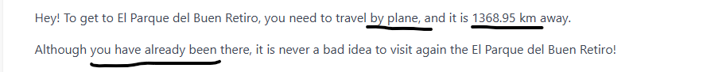

Having said that, my original aim was to add a Temperature Trend chart to the same Station view routed in.

```
router.get("/station/:id", stationController.index);
```

However, I could not get the chart to render on the above-mentioned view for some reason that I evidently failed to understand.

The **report.json** offers a clear picture of the weather conditions data retrieved.

```
 "currentHour": "2024-07-21 09:35:28",
      "title": "Milan",
      "longitude": 9.1895,
      "latitude": 45.4643,
      "code": 800,
      "iconCodeReport": "01d",
      "weatherTypeReport": "Clear",
      "temperature": 28.65,
      "tempFar": 83.57,
      "maxTempReport": 29.65,
      "minTempReport": 27.66,
      "feelsLikeReport": 30.74,
      "humidityReport": 62,
      "windSpeed": 2.57,
      "pressure": 1010,
      "windDir": 160,
      "tempTrend": [
        33.63,
        36.33,
        36.08,
        33.63,
        33.21,
        30.79,
        29.55,
        33.94,
        37.74,
        38.05
      ],
      "trendLabels": [
        "2024-07-21 12:00:00",
        "2024-07-21 15:00:00",
        "2024-07-21 18:00:00",
        "2024-07-21 21:00:00",
        "2024-07-22 00:00:00",
        "2024-07-22 03:00:00",
        "2024-07-22 06:00:00",
        "2024-07-22 09:00:00",
        "2024-07-22 12:00:00",
        "2024-07-22 15:00:00"
      ],
      "_id": "708c99f2-4480-4ea5-8f73-a97fc13d83f8",
      "stationid": "649823c0-5cc8-4fa5-9271-39365fcd3c6e"
    },
```

#### Source attribution

https://frappe.io/charts

https://bulma.io/documentation/components/card/

https://www.flaticon.com/

https://stackoverflow.com/questions/15992085/html-select-drop-down-with-an-input-field

### Account

This page is where the user can check their personal details and update them via a Bulma form:

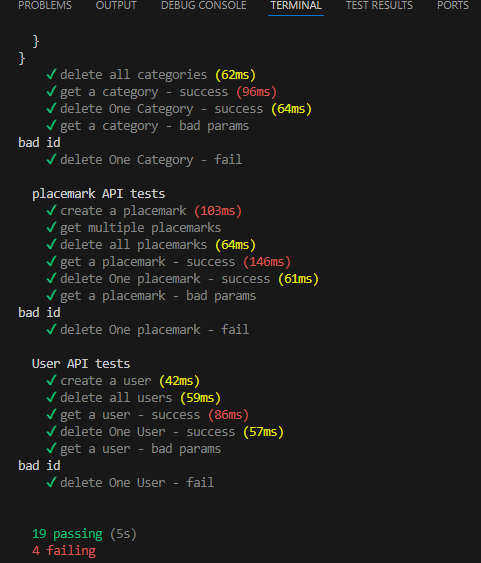

The **account-controller.hbs** renders the page through the below action

```
/* The below 'account' action is invoked when "/account" route is triggered and renders the user's data */
  async account(request, response) {
    const user = await accountsController.getLoggedInUser(request);
    const firstName = user.firstName;
    const lastName = user.lastName;
    const email = user.email;
    const password = user.password;
    const _id = user._id;
      const viewData = {
        title: "Account",
        firstName: firstName,
        lastName: lastName,
        email: email,
        password: password,
        _id: _id,
      };
      response.render("account-view", viewData);
    },
```

and routed in

```
router.get("/account/", accountsController.account);
```

Once the user changes the form field values and clicks on the CTA 'Update User', the action into the form tag in **edit-user.hbs** response

```
<form class="box" action="/account/updateuser/" method="POST">
```

routed by

```
router.post("/account/updateuser/", accountsController.update);
```

will trigger a response put into action by the **accounts-controller.hbs** action below

```
 /* The below 'account' action is invoked when "/account/edituser/" route is triggered and updates the user's data */
  async update(request, response) {
    console.log(request.body);
    // Discovering which user is logged in by retrieving the data from them model 'user-store.js'.
    const user = await accountsController.getLoggedInUser(request);
    // Passing user data throught to the 'updateUser' object
    const firstName = request.body.firstName;
    const lastName = request.body.lastName;
    const email = request.body.email;
    const password = request.body.password;
    const _id = request.body._id;
    const updatedUser = {
      firstName: firstName,
      lastName: lastName,
      email: email,
      password: password,
      _id: user._id,
     };
    // The below 'updateUser()' function from the 'user-store.js' file will update the user's data
    await userStore.updateUser(user, updatedUser);
    // The cookie 'station' will be created and will contain the user's email
    response.cookie("station", user.email, user.password);
    console.log(`updating ${user.email}`);
    response.redirect("/login/");
  },
```

The function updateUser() in **user-store.hbs** will then help store the update user data

```
  async updateUser(user, updatedUser) {
    user._id = updatedUser._id;
    user.firstName = updatedUser.firstName;
    user.lastName = updatedUser.lastName;
    user.email = updatedUser.email;
    user.password = updatedUser.password;
    await db.write();
  },
```

and will show them in the **user.json**

```
"firstName": "weather",
     "lastName": "top",
     "email": "weathertopapp@gmail.com",
     "password": "weathertopapp76",
     "_id": "cb48cff2-6d0a-40d5-b277-93ce618475d5"
   },
```

#### Source attribution

https://bulma.io/documentation/form/

## Bugs/Defects

- Whenever I delete all reports in the Station view, its station still shows the last report weather conditions data (deleted) in the Dashboard view.

- I have not been able to set markers on the map to point each station geolocation on the Dashboard view map.

# Contact info

Users can contact me at andrea.nardinocchi76@gmail.com or by clicking on the website underfoot where they can find my name linking to my Linkedin profile.

# Who maintains and contributes to the project

This project will be maintained by myself only.

# Acknowledgements

My lecture John Rellis provided all info I needed to build and set up the pages by transferring knowledge of programming/web-development 2 languages and tools such as HTML, Bulma CSS framework, Javascript, node.js, Express/Handlebars, Glitch, + lowdb database.

Special thanks to John Rellis again!
I also would like to thank and acknowledge Giovanni's, Noemi Lovei's, David O'Connor's help, but, most of all, a special thanks to Wolfgang Helnwein who patiently helped me out and came to my rescue when I was only seeing doom and gloom and could not get the Dashboard view to display weather conditions data for each station added by the user. Without his invaluable help, I would have likely dropped out of the course altogether.

Thank you all again!!!
